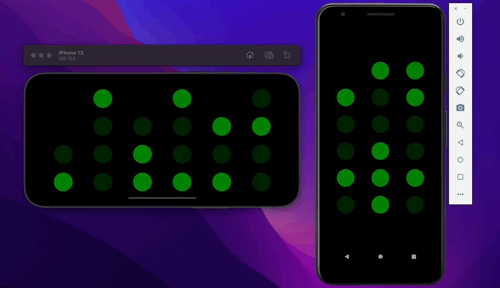

<div align="center">

# Binary Clock

A nerdy way to tell time on Android/iOS 🕓

<!-- BADGES -->
[](https://github.com/thehale/BinaryClock/blob/master/LICENSE)
[](https://github.com/sponsors/thehale)
[](https://jhale.dev)
[](https://www.linkedin.com/comm/mynetwork/discovery-see-all?usecase=PEOPLE_FOLLOWS&followMember=thehale)


[](https://play.google.com/store/apps/details?id=dev.jhale.binaryclock)
[](https://apps.apple.com/us/app/binary-clock-by-jhale-dev/id6448813967?uo=4)

</div>

## How it works

The Binary Clock is written in [React Native](https://reactnative.dev)
which allows it to run on both Android and iOS with most of the code
shared between the two apps.

The implementation is relatively straightforward: grab the current
system time at regular intervals and convert the hours, minutes, and
seconds values to binary digits which are used to brighten or dim
corresponding squares on the screen.

## Built-in Customization Options!



The Binary Clock has a built-in settings page where you can configure the brightness of the clock and enable hints!

More settings are planned for the future (e.g. [choosing the clock's
color](https://github.com/thehale/BinaryClock/issues/3)). Feel free
to [open a feature
request](https://github.com/thehale/BinaryClock/issues/new/choose)
with any ideas you may have!

## Contributing

See [CONTRIBUTING.md](CONTRIBUTING.md)

## License

```
`BinaryClock` by Joseph Hale is licensed under the terms of the Mozilla
Public License, v 2.0, which are available at https://mozilla.org/MPL/2.0/.

You can download the source code for `BinaryClock` for free from
https://github.com/thehale/BinaryClock.
```

### TL;DR

You can use files from this project in both open source and proprietary
applications, provided you include the above attribution. However, if
you modify any code in this project, or copy blocks of it into your own
code, you must publicly share the resulting files (note, not your whole
program) under the MPL-2.0. The best way to do this is via a Pull
Request back into this project.

If you have any other questions, you may also find Mozilla's [official
FAQ](https://www.mozilla.org/en-US/MPL/2.0/FAQ/) for the MPL-2.0
license insightful.

If you dislike this license, you can contact me about negotiating a
paid contract with different terms.

**Disclaimer:** This TL;DR is just a summary. All legal questions
regarding usage of this project must be handled according to the
official terms specified in the `LICENSE` file.

### Why the MPL-2.0 license?

I believe that an open-source software license should ensure that code
can be used everywhere.

Strict copyleft licenses, like the GPL family of licenses, fail to
fulfill that vision because they only permit code to be used in other
GPL-licensed projects. Permissive licenses, like the MIT and Apache
licenses, allow code to be used everywhere but fail to prevent
proprietary or GPL-licensed projects from limiting access to any
improvements they make.

In contrast, the MPL-2.0 license allows code to be used in any software
project, while ensuring that any improvements remain available for
everyone.
